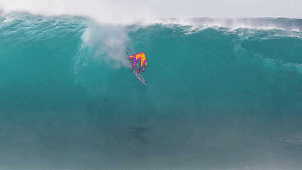

# Mask RCNN and Sobel Transform Powered Animations

## Instructions

1. Install [docker](https://docs.docker.com/get-docker/).
2. Run `make build`
3. Run `make launch_notebook`
4. Open notebook located in `dev/cv_art.ipynb` within container to follow the rest of the steps! 